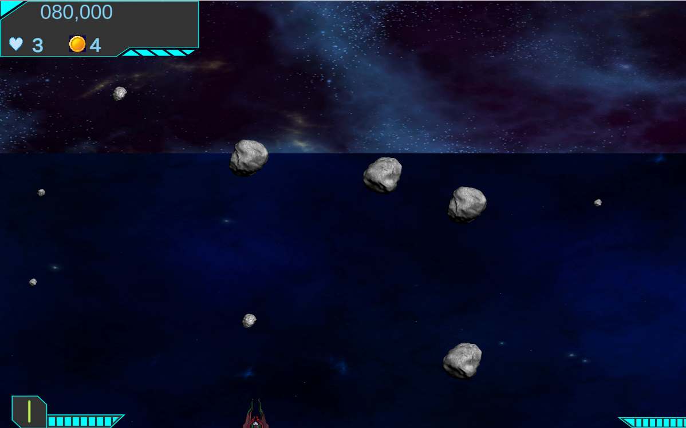

<!-- PROJECT LOGO -->
 

  

<h3 align="center">Spaceship_Invaders</h3>

  

    Một tựa game Shoot 'em up lấy cảm hứng từ dòng game Chicken Invaders.
     
    <a href="https://ndmt9102.itch.io/spaceship-invaders"><strong>Chơi ngay tại đây »</strong></a>
  

<!-- GETTING STARTED -->
## Chơi game
1. Truy cập https://ndmt9102.itch.io/spaceship-invaders
2. Nhấn vào nút Run game.

### Cách điều khiển nhân vật:

Chuột trái - Bắn

Nhấn con lăn chuột - Đổi vũ khí

P - Dừng game, truy cập cửa hàng.

Q, W, E, R, T - Kỹ năng

### Cheats:

U - Thêm mạng

N - Bỏ qua màn chơi

Chuột phải - Nâng cấp vũ khí ngay lập tức

(<a href="#readme-top">back to top</a>)

<!-- ABOUT THE PROJECT -->
## Về dự án

Lấy cảm hứng từ tựa game Chicken Invaders, Spaceship Invaders được tạo ra 2 sinh viên đại học Công Nghệ Thông Tin của DHQG Tp.HCM nhằm tìm hiểu và áp dụng công nghệ Unity2D.

(<a href="#readme-top">back to top</a>)

